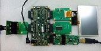

.. _Display_Video_Demo_Quickstart:

Display Video Demo Quickstart Guide
===================================

In this demonstration we use the following hardware and software to display the image frames captured by the image sensor in the form of video.

  * XP-SKC-L16 sliceKIT 
  * XA-SK-SDRAM Slice Card,
  * XA-SK-IMAGE SENSOR Slice Card,
  * module_sdram,
  * module_slicekit_support,
  * module_image_sensor
  * module_i2c_master,
  * module_display_controller
  * module_lcd

Hardware Setup
++++++++++++++

The XP-SKC-L16 sliceKIT Core board has four slots with edge connectors: ``SQUARE``, ``CIRCLE``, ``TRIANGLE`` 
and ``STAR``. 

To setup up the system:

   #. Connect XA-SK-SDRAM Slice Card to the ``STAR`` slot of XP-SKC-L16 sliceKIT Core board.
   #. Connect XA-SK-IMAGE SENSOR Slice Card to the ``CIRCLE`` slot.
   #. Connect XA-SK-SCR480 Slice Card with LCD to the ``TRIANGLE`` slot.
   #. Connect the xTAG Adapter to sliceKIT Core board, and connect xTAG-2 to the adapter. 
   #. Connect the xTAG-2 to host PC. Note that the USB cable is not provided with the sliceKIT starter kit.
   #. Set the ``XMOS LINK`` to ``OFF`` on the xTAG Adapter(XA-SK-XTAG2).
   #. Switch on the power supply to the sliceKIT Core board.
  

   Hardware Setup for Display Video Demo
   
   
	
Import and Build the Application
++++++++++++++++++++++++++++++++

   #. Open xTIMEcomposer and check that it is operating in online mode. Open the edit perspective (Window->Open Perspective->XMOS Edit).
   #. Locate the ``'Display Video Demo'`` item in the xSOFTip pane on the bottom left of the window and drag it into the Project Explorer window in the xTIMEcomposer. This will also cause the modules on which this application depends to be imported as well. 
   #. Click on the ``app_display_video`` item in the Explorer pane then click on the build icon (hammer) in xTIMEcomposer. Check the console window to verify that the application has built successfully.
   #. There will be quite a number of warnings that ``bidirectional buffered port not supported in hardware``. These can be safely ignored for this component.

For help in using xTIMEcomposer, try the xTIMEcomposer tutorial, which you can find by selecting Help->Tutorials from the xTIMEcomposer menu.

Note that the Developer Column in the xTIMEcomposer on the right hand side of your screen provides information on the xSOFTip components you are using. Select the module_display_controller component in the Project Explorer, and you will see its description together with API documentation. Having done this, click the `back` icon until you return to this quickstart guide within the Developer Column.

Run the Application
+++++++++++++++++++

Now that the application has been compiled, the next step is to run it on the sliceKIT Core Board using the tools to load the application over JTAG (via the xTAG-2 and xTAG Adapter card) into the xCORE multicore microcontroller.

   #. Select the ``app_display_video`` project from the Project Explorer.
   #. Click on the ``Run`` icon (the white arrow in the green circle). 
   #. At the ``Select Device`` dialog select ``XMOS xTAG-2 connect to L1[0..1]`` and click ``OK``.
   #. The video is displayed on the LCD.

In an indoor environment illuminated with electric lamps, if the quality of video is not good, AGC is enabled in ``image_sensor_defines.h``. The value of ``DIG_GAIN`` is then adjusted to get a video of better quality.